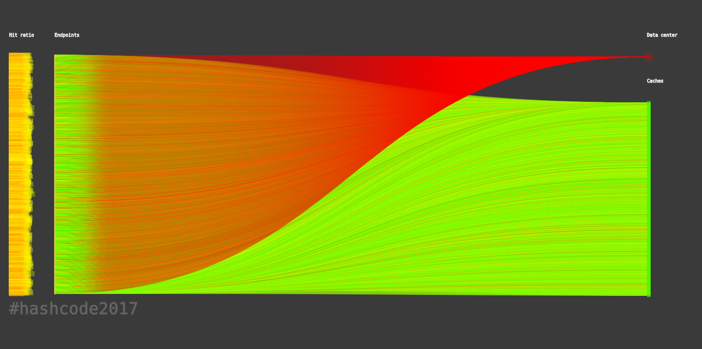
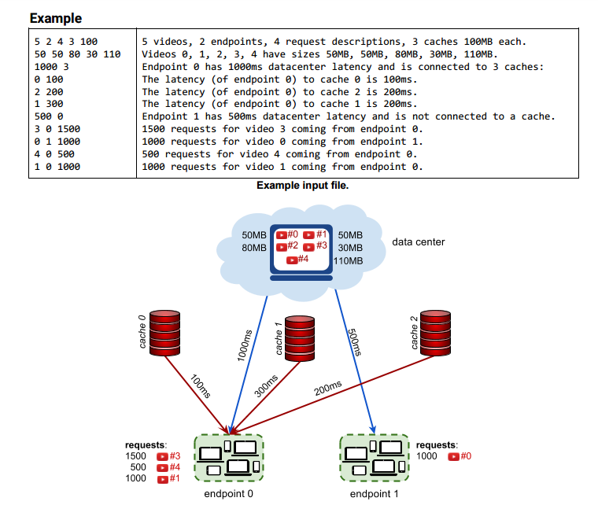
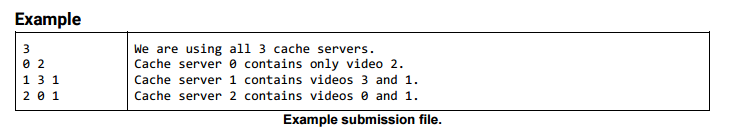
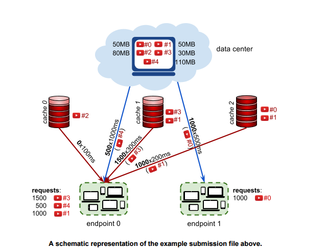
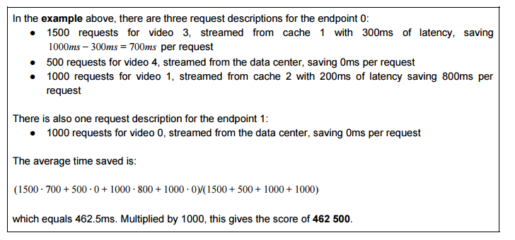

**Introduction**

Have you ever wondered what happens behind the scenes when you watch a YouTube video? As more
and more people watch online videos (and as the size of these videos increases), it is critical that
video-serving infrastructure is optimized to handle requests reliably and quickly.

This typically involves putting in place cache servers, which store copies of popular videos. When a user
request for a particular video arrives, it can be handled by a cache server close to the user, rather than by a
remote data center thousands of kilometers away.

But how should you decide which videos to put in which cache servers?

**Task**

Given a description of cache servers, network endpoints and videos, along with predicted requests for
individual videos, decide which videos to put in which cache server in order to minimize the average
waiting time for all requests.

**Problem description**

The picture below represents the video serving network.

**Visualization result of our submission**

_Kittens_

_Trending today_

_Me at the zoo_

**Videos**

Each video has a size given in megabytes (MB). The data center stores all videos​. Additionally, each video
can be put in 0, 1, or more cache servers​. Each cache server has a maximum capacity given in
megabytes.

**Endpoints**

Each endpoint ​represents a group of users connecting to the Internet in the same geographical area (for
example, a neighborhood in a city). Every endpoint is connected to the data center. Additionally, each
endpoint may (but doesn’t have to) be connected to 1 or more cache servers.
Each endpoint is characterized by the latency of its connection to the data center (how long it takes to serve
a video from the data center to a user in this endpoint), and by the latencies to each cache server that the
endpoint is connected to (how long it takes to serve a video stored in the given cache server to a user in
this endpoint).

**Requests**

The predicted requests provide data on how many times a particular video is requested from a particular
endpoint.

**Input data set**

The input data is provided as a data set file - a plain text file containing exclusively ASCII characters with a
single ‘\n’ character at the end of each line (UNIX-style line endings).
Videos, endpoints and cache servers are referenced by integer IDs. There are V videos numbered from 0
to V − 1 , E endpoints numbered from 0 to E − 1 and C cache servers numbered from 0 to C − 1 .

The first line of the input contains the following numbers:   
   + V​ (1 ≤ V ≤ 10000) - the number of videos
   + E (1 ≤ E ≤ 1000) - the number of endpoints
   + R (1 ≤ R ≤ 1000000) - the number of request descriptions
   + C (1 ≤ C ≤ 1000) - the number of cache servers
   + X (1 ≤ X ≤ 500000) - the capacity of each cache server in megabytes

The next line contains V​ numbers describing the sizes of individual videos in megabytes: S , , .. S . 0 S1. V −1
S is the size of video i in megabytes i (1 ≤ S 000) i ≤ 1

The next section describes each of the endpoints one after another, from endpoint 0 to endpoint E − 1 . The
description of each endpoint consists of the following lines:

 + a line containing two numbers:
      +  L​D (2 ≤ L 000) - the latency of serving a video request from the data center to this D ≤ 4
endpoint, in milliseconds
      + K​ (0 ≤ K ≤ C) - the number of cache servers that this endpoint is connected to
 + K lines describing the connections from the endpoint to each of the K connected cache servers.
Each line contains the following numbers:
      + c​ (0 ≤ c < C) - the ID of the cache server
      + L​c (1 ≤ Lc ≤ 500) - the latency of serving a video request from this cache server to this
endpoint, in milliseconds. You can assume that latency from the cache is strictly lower than
latency from the data center (1 ≤ Lc < L ) . 

Finally, the last section contains R ​request descriptions in separate lines. Each line contains the following
numbers:
+ R​v​ (0 ≤ Rv < V ) - the ID of the requested video
+ R​e​ (0 ≤ Re < E) - the ID of the endpoint from which the requests are coming from
+ R​n​ (0 < Rn ≤ 10000) - the number of requests

**Connections and latencies between the endpoints and caches of example input**

**Submissions**

**File format**

Your submission should start with a line containing a single number N ( 0 ≤ N ≤ C ) - the number of cache
server descriptions to follow.

Each of the subsequent N lines should describe the videos cached in a single cache server. It should
contain the following numbers:
+ c​ (0 ≤ c < C) - the ID of the cache server being described,
+ the IDs of the videos stored in this cache server: v0, ... , vn (0 ≤ vi < V ) (at least 0 and at most V numbers), given in any order without repetitions

Each cache server should be described in at most one line. It is not necessary to describe all cache
servers: if a cache does not occur in the submission, this cache server will be considered as empty. Cache
servers can be described in any order.

**Validation**

The output file is valid if it meets the following criteria:
+ the format matches the description above
+ the total size of videos stored in each cache server does not exceed the maximum cache server capacity

**Scoring**

The score is the average time saved per request, in microseconds. (Note that the latencies in the input file
are given in milliseconds. The score is given in microseconds to provide a better resolution of results.)
For each request description in the input file, we choose the best way to stream the video R​v
(Rv, Re, Rn) to the endpoint R​e​. We pick the lowest possible latency , where LD L = min(L , , .. , ) is the latency of D L0. Lk−1
serving a video to the endpoint R​e from the data center, and L0, ... , Lk−1 are latencies of serving a video to
the endpoint R​e ​ from each cache server that:

+ is connected to the endpoint R​e​, and
+ contains the video R​v

The time that was saved for each request is LD − L (This is the time it would take to stream the video from
the data center, minus the time it actually took. If the video is in fact streamed from the data center, the time
saved is 0.)

As each request description describes R​n
requests, the time saved for the entire request description is Rn × (L ) . D − L

To compute the total score for the data set, we sum the time saved for individual request descriptions in
milliseconds, multiply by 1000 and divide it by the total number of requests in all request descriptions,
rounding down.

_© Google 2017, All rights reserved._
